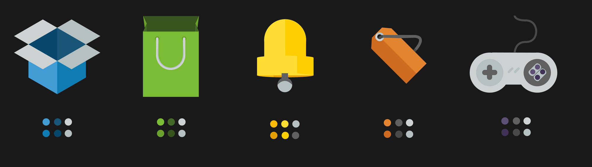

# Six Color Icon Pack

### 3 hues, 2 shades color constraint
The concept is to create icons that feature all of the benfits of flat design (quick readablity, low file size, scalable) but keep them slightly more visually interesting by looking at these flat shapes from skewed angles - 3d flat icons basically.
The icons can be built with any clean geometry, but must remain vector, no texturing, no erasing, just shapes. The colors however are limted to 6 shades per icon, 2 of them can be any RGB color,1 is restricted to grayscale, each color is then lightened or darkened to produce the remaining 3 swatches.

### technical details
Each icon is drawn on a 288px X 360px artboard, but of course sense they are vector this size doesn't mean much. This lines up with the medium sized grid guidelines on AI CS6, or 72px squared with 8 subdivisions. The icon itself should be housed in the upper 288 X 288 region, with margins of 1/2 of a grid unit (35.5px) The remaining 72px X 288px area should be used to house the color swatches, each sized at 1/4 of a grid unit (17.75px) with 1/8 of space between(8.875px). These measurements are all marked down in _master.ai
